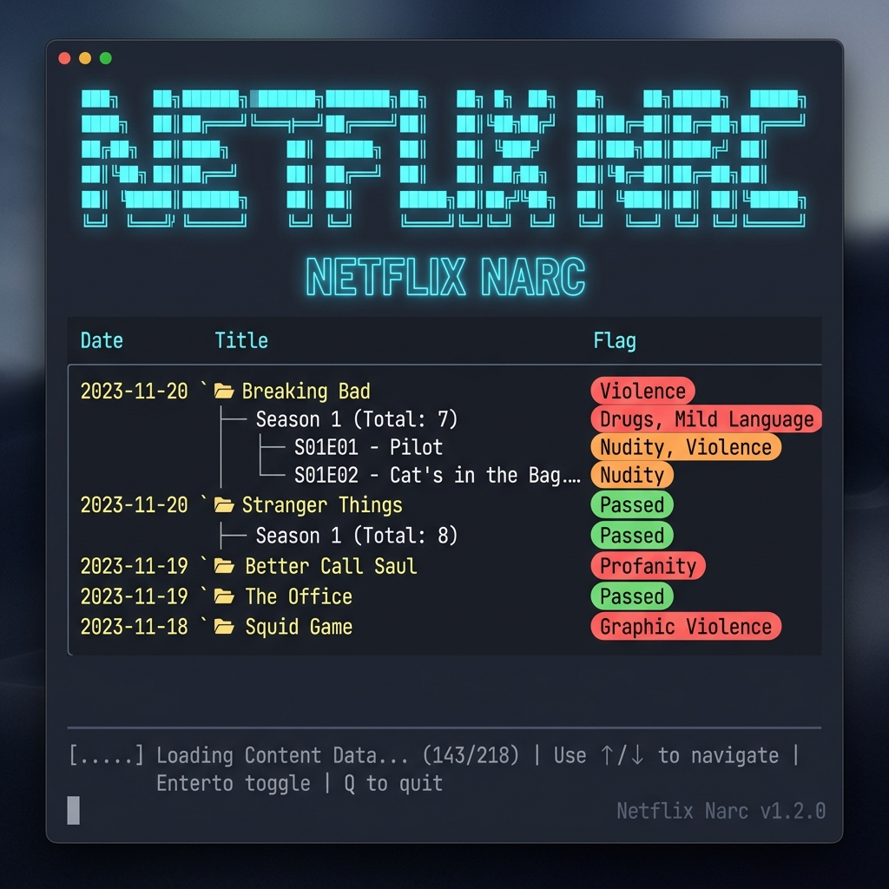

# Netflix Narc 🕵️‍♂️🍿


**Your automated, terminal-based snitch.**

Netflix Narc is a fast, beautiful Terminal UI built to ingest your family's Netflix viewing history, cross-reference it with the **Common Sense Media API**, and gently narc on anyone watching something they shouldn't.

Whether it's too violent, contains sketchy language, or is just completely devoid of educational value, you decide the criteria, and Netflix Narc tells you who's been watching it.

## ✨ Features

- **🍿 Netflix Integration**: Easily ingest your profile's `NetflixViewingHistory.csv`.
- **🧠 Common Sense Intel**: Automatically fetches age ratings, quality scores, and granular category breakdowns (Violence, Language, Educational Value, etc.) from Common Sense Media.
- **⚖️ Weighted Justice**: Customize how strictly you want to judge different content categories.
- **🖥️ Beautiful TUI**: A gorgeous, reactive terminal interface powered by Textual.
- **⚡️ Fast & Polite**: Intelligent caching ensures we don't spam the API or get rate-limited.

## 📸 App in Action



## 🚀 Getting Started

Netflix Narc requires `uv` to run.

### Quick Install (recommended)

```bash
uv tool install git+https://github.com/Kilo59/netflix-narc
netflix-narc --help
```

### Development Install

1. Clone the repository and navigate into the `netflix-narc` directory.
2. Install dependencies with `uv sync`.
3. Run via `uv run netflix-narc`.

### Prerequisites
- Python 3.13+
- An **OMDb API Key** (recommended) — grab a free key at [omdbapi.com](https://www.omdbapi.com/apikey.aspx)
- Your exported `NetflixViewingHistory.csv`
   *(Netflix Account Settings → Profile & Parental Controls → Viewing activity → Download all)*

### Installation & Usage

```bash
# Point to your history file explicitly (recommended)
uv run netflix-narc --csv /path/to/NetflixViewingHistory.csv

# Or drop the file in the current directory and run without arguments
uv run netflix-narc
```

On first launch, press `s` to open Settings and enter your API key.

### ⌨️ Keybindings

- `l`: Load CSV File
- `e`: Evaluate CSM Data
- `s`: Settings & API Key
- `Enter`: Expand/Collapse a show's episodes
- `q`: Quit Application

## 📜 How it Works
1. You provide your Netflix viewing history.
2. The UI groups your watches by Show/Movie.
3. You press `e` to trigger an evaluation sweep.
4. Netflix Narc cross-references the history against Common Sense Media and highlights exactly where things went wrong based on the `Settings` thresholds.

---

*Built with ❤️ (and a healthy dose of parental suspicion) using Python and Textual.*
