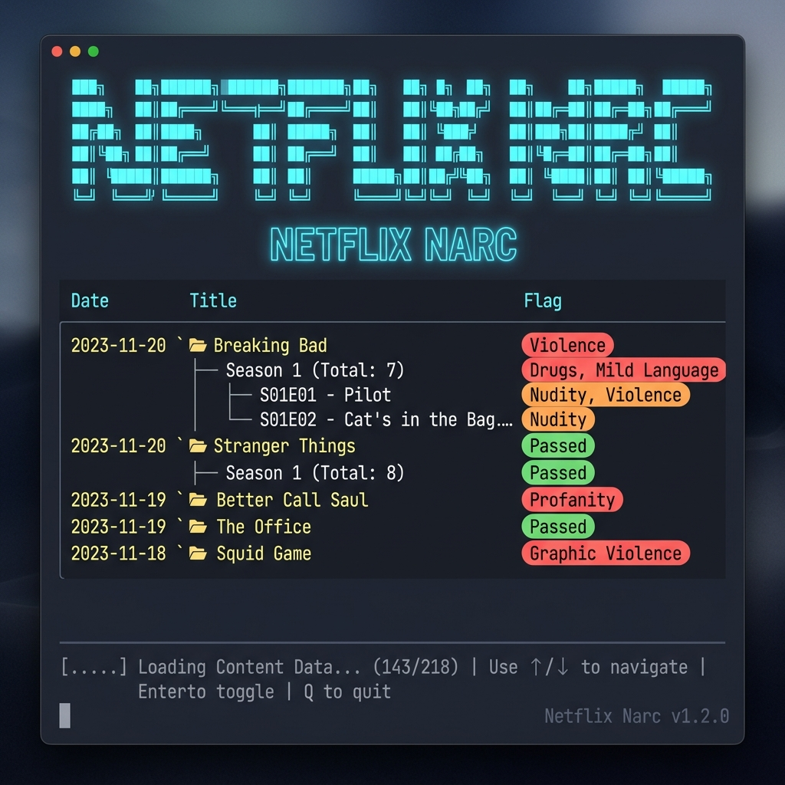

# Netflix Narc 🕵️‍♂️🍿

[](https://pypi.org/project/netflix-narc/)
[](https://pypi.org/project/netflix-narc/)
[](https://opensource.org/licenses/MIT)
[](https://codecov.io/gh/Kilo59/netflix-narc)


**Your automated, terminal-based snitch.**

Netflix Narc is a fast, beautiful Terminal UI built to ingest your family's Netflix viewing history, cross-reference it with content rating APIs, and flag titles that may be inappropriate based on customizable, weighted criteria.

Whether it's too violent, contains sketchy language, or is just completely devoid of educational value — you decide the criteria and Netflix Narc tells you what's been watched.

## ✨ Features

- **🍿 Netflix History Integration**: Ingest your profile's `NetflixViewingHistory.csv` to analyze watching habits.
- **📋 Onboarding Wizard**: First-run setup to configure child age ranges, content weightings, and scoring modes with a live **Weight Impact Preview** (lets you pin titles you know to test weights against real results).
- **🔍 The Lineup & Interrogation Room**: A sequential review queue and manual entry screen to score niche titles across CSM categories (0–5), and attach cover art via URL or macOS clipboard.
- **🧠 Content Metadata**: Automatically fetches age ratings and quality scores from OMDb (default) or Common Sense Media. Fetched results are cached locally to respect API rate limits.
- **📊 Suitability Sub-bars & Scoring Modes**: Expand any show to view sub-bar breakdowns across Base Quality, Age Suitability, Educational Suitability, Positive Content, and Content Safety under **Quality Focus** or **Balanced** scoring modes.
- **⚖️ Weighted Justice**: Customize how strictly you want to judge different content categories (Violence, Language, Drinking/Drugs, etc.).
- **🗄️ Evidence Locker**: A local SQLite database to store your manually entered title dossiers and flag titles for follow-up.
- **☁️ Storage & Sync (BYOS)**: Sync preferences and Evidence Locker dossiers across devices using your own local folder, Cloudflare R2/AWS S3, or Nextcloud/WebDAV.
- **❓ Help Screen**: Built-in keyboard shortcut reference available anywhere via `h` or `?`.
- **🖥️ Reactive TUI**: A responsive, modern terminal UI built with [Textual](https://textual.textualize.io/).

## 📸 App in Action



## 🚀 Getting Started

### ⚡ Quick Start: Standalone Executable (Recommended — No Python Required!)

Download a pre-compiled standalone release from [GitHub Releases](https://github.com/Kilo59/netflix-narc/releases). No Python, `uv`, or setup required.

#### macOS & Linux (Archive — Recommended)
1. Download the archive for your architecture from the [Latest Release](https://github.com/Kilo59/netflix-narc/releases/latest):
   - **macOS (Apple Silicon M1/M2/M3/M4)**: `netflix-narc-aarch64-apple-darwin.tar.gz`
   - **macOS (Intel)**: `netflix-narc-x86_64-apple-darwin.tar.gz`
   - **Linux**: `netflix-narc-x86_64-unknown-linux-gnu.tar.gz`
2. Extract the archive:
   ```bash
   tar -xzf netflix-narc-aarch64-apple-darwin.tar.gz
   ```
3. **macOS Gatekeeper Fix**: If you downloaded the archive via a web browser on macOS, remove the quarantine attribute before launching:
   ```bash
   xattr -d com.apple.quarantine netflix-narc
   ```
   *(Without this step, macOS blocks unnotarized browser downloads with `"netflix-narc Not Opened: Apple could not verify..."` and terminates the process with `killed`).*
4. Launch the executable:
   ```bash
   ./netflix-narc
   ```

> 💡 **Tip (Optional)**: Move `netflix-narc` to `/usr/local/bin/` so you can launch it from any directory:
> ```bash
> sudo mv netflix-narc /usr/local/bin/
> netflix-narc
> ```

*(Note: If you download the raw uncompressed binary file directly, run `chmod +x <binary-name>` once before executing).*

#### Windows
1. Download `netflix-narc-x86_64-pc-windows-msvc.zip` (or the raw `.exe`) from the [Latest Release](https://github.com/Kilo59/netflix-narc/releases/latest).
2. Extract the archive and launch from Command Prompt or PowerShell:
   ```powershell
   .\netflix-narc.exe
   ```

#### 🔒 Verifying Download Integrity
To verify your downloaded release archives against the official `SHA256SUMS` manifest attached to each GitHub Release:
```bash
# macOS
shasum -a 256 -c SHA256SUMS

# Linux
sha256sum -c SHA256SUMS
```


---

### 🐍 Alternative: Package Manager & Source Install (Requires Python 3.13+)

If you already have Python 3.13+ and prefer using a package manager:

#### Via `uv tool` (PyPI)

```bash
uv tool install netflix-narc
netflix-narc --help
```

#### Via `pipx` or `pip`

```bash
pipx install netflix-narc
# or
pip install netflix-narc
```

#### From GitHub Source

```bash
uv tool install git+https://github.com/Kilo59/netflix-narc
```

### Development Setup

1. Clone the repository and navigate into the `netflix-narc` directory.
2. Install dependencies with `uv sync`.
3. Run via `uv run netflix-narc`.


### Prerequisites & Setup
- Python 3.13+ (or download a standalone binary above)
- Your exported `NetflixViewingHistory.csv` (see [Exporting Netflix Viewing History](docs/getting-started/exporting-netflix-csv.md))
- *(Optional)* An **OMDb API Key** — grab a free key at [omdbapi.com](https://www.omdbapi.com/apikey.aspx)

### Running the Application

```bash
# Point to your history file explicitly (recommended)
uv run netflix-narc --csv /path/to/NetflixViewingHistory.csv

# Or drop the file in the current directory as NetflixViewingHistory.csv and run
uv run netflix-narc
```

On first launch, Netflix Narc automatically starts the **Onboarding Wizard** to configure child age targets and content weightings. At any time, press `s` to open **Preferences** or `h` / `?` for **Help**.

## 🔑 API Providers

Netflix Narc fetches title metadata from an external API. The default and recommended provider is **OMDb**.

| Provider | Status | Notes |
|---|---|---|
| **OMDb** (default) | ✅ Recommended | Free API key available at [omdbapi.com](https://www.omdbapi.com/apikey.aspx). Provides MPAA/TV content ratings and IMDb quality scores. Does not provide granular category scores (Violence, Language, etc.). |
| **Common Sense Media** | ⚠️ Advanced | Provides granular category scores. However, CSM does not offer a public API program, so obtaining an API key is not straightforward for most users. |
| **TMDB** | 🚧 Coming Soon | Not yet implemented. |

### A note on Common Sense Media category scores

Even without a CSM API key, you can enter category scores manually in the **Interrogation Room**. Press `F2` from within any title entry to open a browser search on [commonsensemedia.org](https://www.commonsensemedia.org) and look up the scores by hand.

### ☁️ Storage & Multi-Device Sync (BYOS)

Netflix Narc operates **100% local-first** with zero central tracking. If you want to synchronize your Evidence Locker dossiers and preference settings across multiple computers, you can enable **Bring-Your-Own-Storage (BYOS)**:

#### Setup via Preferences (Recommended)
1. Press `s` in the app to open **Preferences**.
2. Select your preferred **Sync Storage Backend** from the dropdown.
3. Fill in your credentials/paths and click **Test Connection**.
4. Click **Save Settings** to persist your setup.

#### Setup via Environment Variables (`~/.config/netflix-narc/.env`)

You can also configure sync directly in your environment or `~/.config/netflix-narc/.env`:

- **Local Folder / Cloud Drive** (iCloud Drive, Dropbox, Syncthing, shared network drive):
  ```env
  SYNC_BACKEND=local_folder
  SYNC_LOCAL_PATH=/Users/username/Library/Mobile Documents/com~apple~CloudDocs/netflix-narc-sync
  ```

- **S3-Compatible Object Storage** (Cloudflare R2, AWS S3, MinIO, Wasabi):
  ```env
  SYNC_BACKEND=s3
  SYNC_S3_ENDPOINT_URL=https://<account_id>.r2.cloudflarestorage.com
  SYNC_S3_BUCKET=my-narc-bucket
  SYNC_S3_ACCESS_KEY_ID=your_access_key_id
  SYNC_S3_SECRET_ACCESS_KEY=your_secret_access_key
  ```

- **WebDAV / Nextcloud / ownCloud**:
  ```env
  SYNC_BACKEND=webdav
  SYNC_WEBDAV_URL=https://nextcloud.example.com/remote.php/dav/files/username/netflix-narc
  SYNC_WEBDAV_USERNAME=your_username
  SYNC_WEBDAV_PASSWORD=your_app_password
  ```

### ⌨️ Keybindings

| Key | Action |
|---|---|
| `l` | Open **The Lineup** (sequential review queue) |
| `i` | Open **Interrogation Room** (manual data entry for selected title) |
| `Space` | Flag selected title for follow-up |
| `s` | Open **Preferences** (settings, weights, API provider & BYOS sync) |
| `a` | Open **Advanced Options** (load CSV, run evaluation) |
| `h` / `?` | Open **Help** overlay |
| `q` | Quit Application |

*(In the Interrogation Room, `F2` opens a browser search for the current title on Common Sense Media.)*

## 📜 How it Works
1. You export your [Netflix viewing history CSV](docs/getting-started/exporting-netflix-csv.md).
2. The **Onboarding Wizard** aligns your target child age and content sensitivity thresholds.
3. Netflix Narc cross-references titles against the active API provider or your local Evidence Locker (manual data takes priority).
4. Use **The Lineup** (`l`) and **Interrogation Room** (`i`) to manually score missing or unrated titles — press `F2` to open a quick browser lookup.
5. Expand any row in the main table to inspect granular suitability sub-bars and exact violation flags.

---

*Built with ❤️ (and a healthy dose of parental suspicion) using Python and Textual.*
