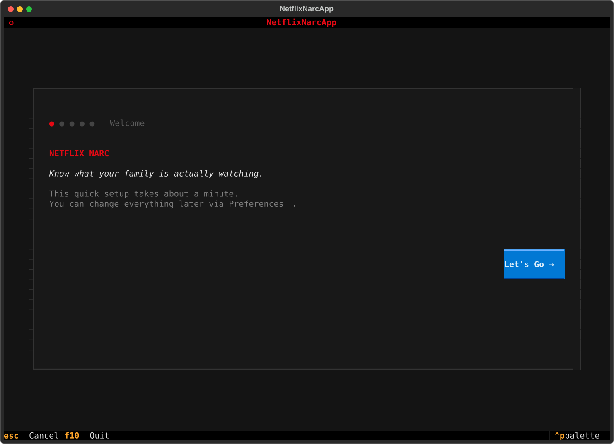
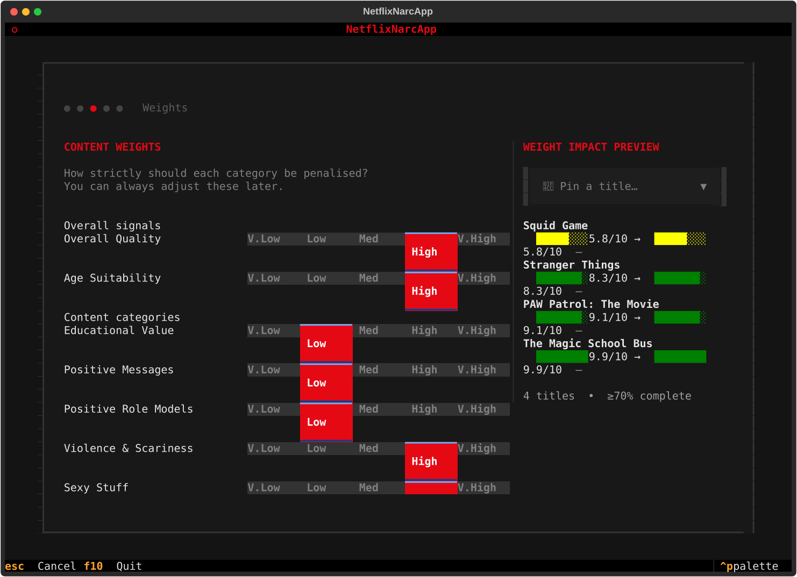
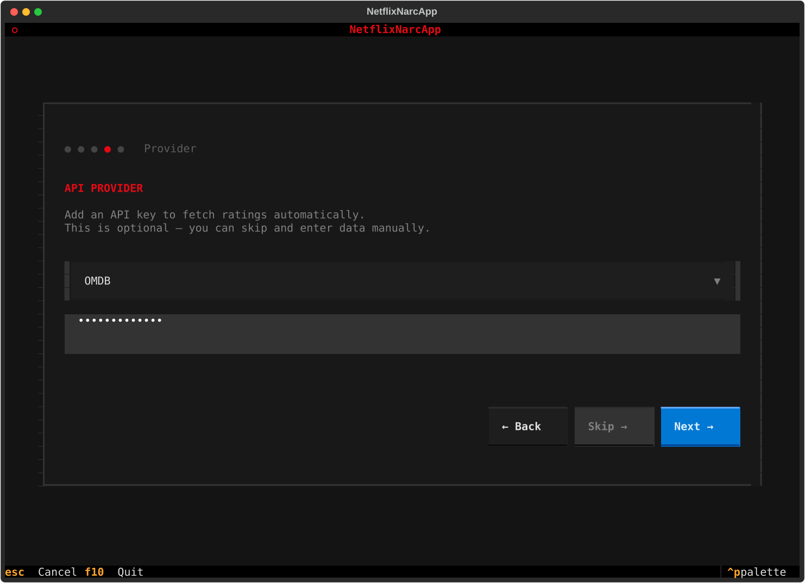

# Onboarding & Initial Setup

When launching **netflix-narc** for the first time, an interactive, multi-step **Onboarding Wizard** (`OnboardingScreen`) automatically greets you to configure your family monitoring defaults.

{: .tui-screenshot }

---

## Step 1: Target Child Age Range

The onboarding wizard begins by asking for the age range of the child or teenager whose viewing history you want to monitor.

- **Age Range Presets & Input**: Enter single ages (e.g. `10`) or ranges (e.g. `8-12`).
- **Safety Baseline**: This setting establishes the age threshold used by the evaluation engine when determining whether a title should be flagged as inappropriate.

---

## Step 2: Content Weights, Scoring Mode & Weight Impact Preview

Configure your content sensitivity weights and choose an evaluation scoring mode.

{: .tui-screenshot }

- **Scoring Modes**: Choose between **Option A (Quality Focus)** or **Option B (Balanced)**.
- **Category Weights**: Adjust 1–5 sensitivity sliders for Violence, Language, Sexual Content, Educational Value, and Positive Role Models.
- **Live Weight Impact Preview**: Observe real-time suitability bar shifts and deltas on sample titles as you adjust weights.

---

## Step 3: Optional API Key Configuration

`netflix-narc` integrates with external metadata services to fetch accurate age ratings, content category breakdowns, and parental guidance reviews.

{: .tui-screenshot }

!!! info "API Keys are Optional!"
    You do **not** need API keys to start using `netflix-narc`. If you don't have API keys, simply press **Skip** or **Next** to complete setup. You can always add API keys later in the Preferences screen or edit your config file directly.

### Provider Details & Registration

| Provider | Purpose | Free Tier / Registration |
|----------|---------|--------------------------|
| **OMDb API** | Fetches IMDb scores, MPAA ratings (PG, PG-13, R), plot summaries, genres, and release years. | Free API Key available at [omdbapi.com/apikey.aspx](https://www.omdbapi.com/apikey.aspx). |
| **TMDB API** | Provides rich movie/TV metadata, content advisory certification ratings, and high-resolution posters. | Free account and API Read Access Token at [themoviedb.org/settings/api](https://www.themoviedb.org/settings/api). |
| **Common Sense Media** | Detailed, age-specific parental reviews with category-specific ratings (Violence, Sex, Language, Consumerism, etc.). | Requires CSM API partner credentials. |

---

## Step 4: Persistence & Config Location

Once setup is complete, all your preferences and API credentials are saved locally on your device in the standard XDG configuration directory:

```text
~/.config/netflix-narc/.env
```

!!! tip "Editing Preferences Later"
    You can re-open the settings panel at any time inside the TUI by pressing <kbd>s</kbd> to open the **Preferences Screen**, or by directly editing `~/.config/netflix-narc/.env` in any text editor.
