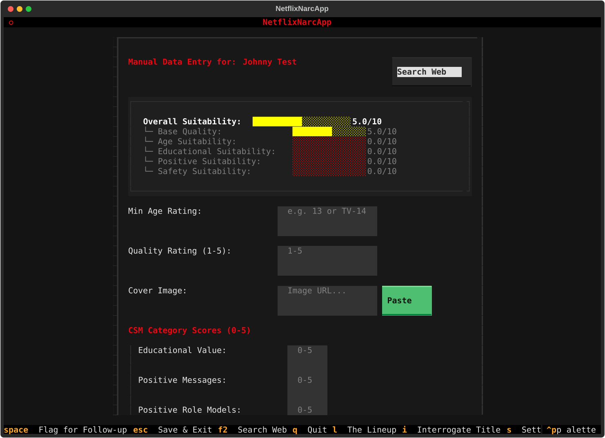
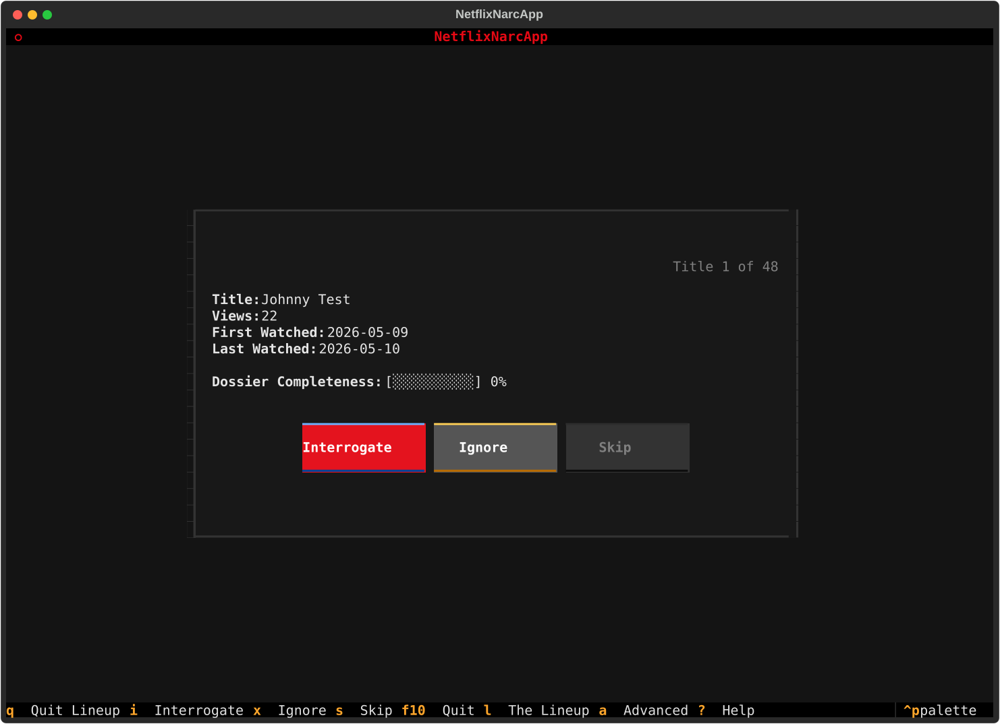
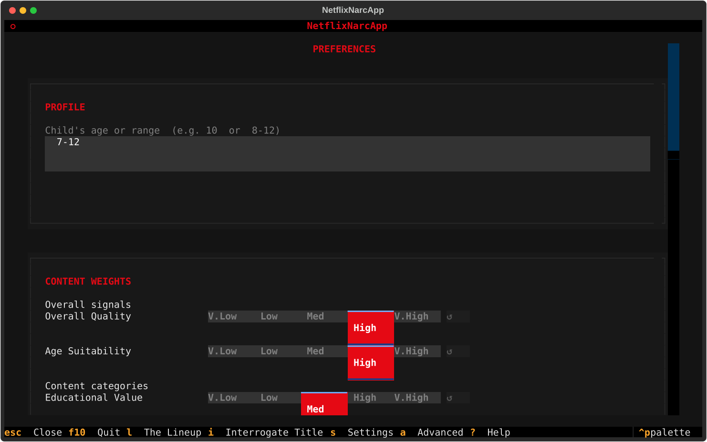
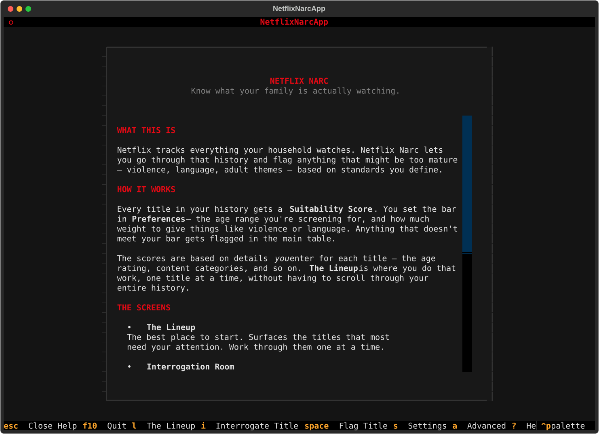
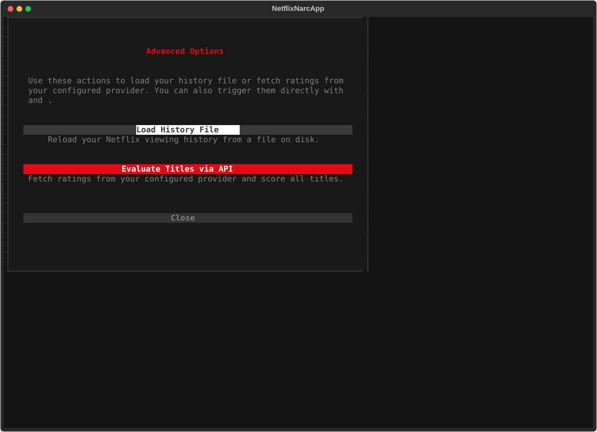

# TUI Feature Walkthrough

**netflix-narc** provides a full-featured, keyboard-driven Terminal User Interface built with [Textual](https://textual.textualize.io/).

---

## Keyboard Shortcuts & Keybindings Reference

### Global Hotkeys

| Keybinding | Screen / Action | Description |
|------------|-----------------|-------------|
| <kbd>l</kbd> | **Lineup Screen** | Open the card-based review queue for sequential title triage. |
| <kbd>i</kbd> | **Interrogation Room** | Edit manual rating overrides and Evidence Locker dossier for the selected title. |
| <kbd>Space</kbd> | **Flag for Follow-up** | Toggle flag for future follow-up on highlighted row or active screen. |
| <kbd>s</kbd> | **Preferences Screen** | Open full preferences panel (weights, scoring mode, provider, BYOS sync). |
| <kbd>a</kbd> | **Advanced Options** | Progressive disclosure modal for power-user actions. |
| <kbd>h</kbd> or <kbd>?</kbd> | **Help Screen** | Display contextual help, philosophy, and keyboard reference. |
| <kbd>c</kbd> | **Load History File** | Reload or open a new Netflix viewing history CSV file. |
| <kbd>e</kbd> | **Evaluate Titles** | Trigger rating metadata fetches for unrated titles via active provider API. |
| <kbd>q</kbd>, <kbd>F10</kbd>, <kbd>Ctrl+C</kbd> | **Quit App** | Safely exit **netflix-narc**. |

### Screen & Context Hotkeys

| Context | Keybinding | Action | Description |
|---------|------------|--------|-------------|
| **Main Table** | <kbd>Enter</kbd> | **Expand / Collapse** | Toggle 5 sub-suitability breakdown bars for highlighted row. |
| **Main Table** | <kbd>Space</kbd> | **Flag for Follow-up** | Toggle flag for future follow-up on highlighted row. |
| **Lineup Queue** | <kbd>i</kbd> | **Interrogate** | Open Interrogation Room for current card title. |
| **Lineup Queue** | <kbd>Space</kbd> | **Flag for Follow-up** | Toggle flag for future follow-up on current card title. |
| **Lineup Queue** | <kbd>x</kbd> | **Ignore Title** | Mark current title as ignored and advance to next item. |
| **Lineup Queue** | <kbd>s</kbd> | **Skip Title** | Skip current title without modifying its status. |
| **Interrogation** | <kbd>Space</kbd> | **Flag for Follow-up** | Toggle 'Flag for future follow-up' checkbox (when no form input is focused). |
| **Interrogation** | <kbd>F2</kbd> | **Web Search** | Open Common Sense Media search for title in default browser. |
| **Modals / Screens** | <kbd>Esc</kbd> | **Close / Back** | Dismiss current screen or modal dialog without saving changes. |

---

## 1. Main Inspection Table (Home Screen)

Upon launching **netflix-narc** after setup, your uploaded Netflix viewing history is presented in the **Main Inspection Table**.

{: .tui-screenshot }

### Features

- **Row Expansion (<kbd>Enter</kbd>)**: Press <kbd>Enter</kbd> or click any row to expand/collapse detailed sub-suitability breakdown bars.
- **Color-Coded Suitability Bars**: Displays overall suitability scores from `0.0/10` to `10.0/10` (🟢 Green $\ge 7.5$, 🟡 Yellow $\ge 5.0$, 🔴 Red $< 5.0$).
- **View Count & Watch Dates**: Displays total view count and first/last watch dates extracted from your Netflix CSV.
### Sub-Suitability Breakdown Bars

When a row is expanded in the main inspection table or inspected in the Interrogation Room, **netflix-narc** displays 5 sub-suitability bars:

| Sub-Bar | Description |
|---------|-------------|
| **Base Quality** | User/critic quality score out of 10.0. |
| **Age Suitability** | Compatibility with your child's age range. |
| **Educational Suitability** | Educational value score scaled by your custom weight. |
| **Positive Content** | Combined score for positive messages and positive role models. |
| **Content Safety** | Combined safety score penalizing violence, sexual content, language, and substance use. |

---

## 2. The Lineup Screen (`l`)

Press <kbd>l</kbd> to enter **The Lineup Screen**—a sequential, card-based review queue designed for fast, focused title triage.

{: .tui-screenshot }

### Features & Actions

- **Sequential Card View**: Displays titles one at a time with title metadata, view count, and watch history dates.
- **Dossier Completeness Progress Bar**: Shows current Evidence Locker completeness (e.g., `[████████░░] 80%`).
- **Triage Actions**:
  - <kbd>i</kbd> **Interrogate**: Open the Interrogation Room to input manual category ratings and notes.
  - <kbd>x</kbd> **Ignore**: Mark the title as ignored so it drops out of active review queues.
  - <kbd>s</kbd> **Skip**: Skip to the next title in the review queue.

---

## 3. The Interrogation Room (`i`)

When external APIs lack rating data for a niche title, or when you disagree with automated ratings, the **Interrogation Room** provides a manual data entry and evaluation workbench.

{: .tui-screenshot }

### Features & Capabilities

- **Real-Time Suitability Dashboard**: Recalculates overall suitability scores and color-coded sub-bars in real-time as you type or adjust scores.
- **5 Sub-Suitability Score Bars**: Visual indicators for Base Quality, Age Suitability, Educational Suitability, Positive Content, and Content Safety.
- **Category Severity Scores**: Input 0–5 rating scores for:
  - *Violence & Scariness*, *Language*, *Sexy Stuff*, *Drinking, Drugs & Smoking*, *Educational Value*, *Positive Messages*, *Positive Role Models*.
- **Quality Rating (1.0–5.0 stars)**: Input star ratings which are clamped and mapped to normalized 0–10 scores.
- **Cover Image Attachment**:
  - **Paste Image from Clipboard**: On macOS, click **Paste Cover Image** to attach an image from your clipboard directly into the dossier.
  - **URL Download**: Enter any HTTP(S) image URL to auto-download and store cover art locally.
- **Web Search Shortcut (<kbd>F2</kbd>)**: Opens Common Sense Media search for the active title in your web browser.
- **Flag for Follow-up**: Checkbox to mark titles requiring further parental discussion.
- **Async Evidence Locker Storage**: Saves your custom notes, scores, and image references into a local SQLite database (`manual_db.sqlite`). Manual entries override or supplement API metadata.

---

## 4. Preferences & Live Weight Impact Preview (`s`)

Press <kbd>s</kbd> to open the **Preferences Screen** to tune your evaluation algorithm.

{: .tui-screenshot }

### Scoring Modes

**netflix-narc** supports two distinct evaluation algorithms depending on your family's filtering philosophy. Both modes calculate a final suitability score from `0.0` to `10.0`, but process quality signals and safety gate factors differently:

#### Option A: Quality Focus (`quality_focus`)
- **How It Works**: Base Quality (user/critic rating), Educational Value, and Positive Content form a *Quality Base Score*. Gate factors (**Age Suitability** and **Content Safety**) act strictly as *penalty-only deductions*.
- **Mathematical Mechanics**: Gate factors only subtract points when they fall below `10.0`. High or perfect gate scores (e.g. `10/10` content safety) will **never** inflate a low-quality title's score, but content safety concerns or age misfits will directly penalize the quality-driven base rating.
- **Best For**: Parents who want high-quality family content to shine, but want mature, violent, or age-inappropriate content heavily penalized regardless of how high its critic ratings are.

#### Option B: Balanced (`balanced`) *(Default)*
- **How It Works**: All 5 sub-suitability components (Base Quality, Age Suitability, Educational Value, Positive Content, and Content Safety) contribute to a weighted average score.
- **Mathematical Mechanics**: Gate safety factors are capped at a neutral ceiling of `7.0/10` (`GATE_NEUTRAL_CAP`) before entering the weighted average calculation. This prevents completely safe but low-quality or non-educational shows from receiving an artificially inflated `10.0` overall suitability score simply because they contain zero violence or language.
- **Best For**: A holistic view where strong educational value, positive messages, or high quality can offset mild content concerns or minor age discrepancies.

#### 🛡️ Which Mode is Safer for Flagging Inappropriate Content?

- **Option A (Quality Focus) is the STRICTER / SAFER mode for flagging inappropriate content.** Because content safety issues and age misfits act as direct, unmitigated penalty deductions subtracted from the quality base score, any show with high violence, sexual content, bad language, or drug use is penalized aggressively. High critic reviews or positive messages **can never shield or inflate** a show that has content safety violations.
- **Option B (Balanced) is MORE FORGIVING.** Because all 5 components contribute to a single weighted average pool, high quality ratings or strong educational themes can partially cushion or soften mild content warnings.

> 💡 **Rule of Thumb**: If your primary goal is **strict content protection** (zero-tolerance for inappropriate content), choose **Option A (Quality Focus)**. If your goal is a **holistic evaluation** (where educational merit or high quality can offset minor concerns), choose **Option B (Balanced)**.

!!! tip "Recommended Calibration Strategy: Pin Titles You Know Well"
    When tuning your scoring mode and category sensitivity weights, we strongly recommend picking 2–3 titles in your viewing history that you know intimately (for example: one show you consider ideal for your child, one borderline show, and one show you strictly prohibit).

    Use the **📌 Pin a Title** selector in the **Live Weight Impact Preview** panel to pin each title, then toggle between **Quality Focus** and **Balanced** modes while adjusting category sliders. Watch how the real-time suitability bars and delta indicators react for those specific titles to confirm your configuration delivers optimal, expected outcomes for your household.

### Category Sensitivity Weights

Customizable 1–5 scale sliders let you tune how aggressively specific concerns lower suitability:

- **Overall Signals**: Base Quality weight, Age Suitability weight.
- **Content Categories**: Educational Value, Positive Messages, Positive Role Models, Violence & Scariness, Sexual Content, Language, Drinking/Drugs/Smoking.

### Live Weight Impact Preview

During Onboarding and inside Preferences, **netflix-narc** renders a side-by-side **Weight Impact Preview** panel:

- **Before / After Suitability Bars**: Displays instant visual comparison bars showing how your weight changes adjust suitability scores across sample titles in your Evidence Locker.
- **Delta Indicator**: Shows exact numeric score shifts (e.g., `+1.2` or `-0.8`).
- **📌 Pin a Title Selector**: Allows you to pin a specific title to watch its suitability score react in real-time as you tweak individual sliders. We recommend pinning titles you know well to test and verify your settings against known baseline expectations.

---

## 5. The Help Screen (`h` / `?`)

Press <kbd>h</kbd> or <kbd>?</kbd> at any time to open the **Help Screen**.

{: .tui-screenshot }

### Content & References

- **App Philosophy & Guidance**: Explains how **netflix-narc** balances parental guidance and content evaluation.
- **Scoring System Overview**: Quick reference for suitability thresholds and color bars.
- **Keyboard Shortcut Reference**: Comprehensive table of global and screen-specific hotkeys.

---

## 6. Advanced Options Modal (`a`)

Press <kbd>a</kbd> to open the **Advanced Options** modal for progressive disclosure of power-user actions.

{: .tui-screenshot }

### Actions & Configuration

- **Load History File (<kbd>c</kbd>)**: Prompts to reload or switch Netflix viewing history CSV files.
- **Evaluate Titles via API (<kbd>e</kbd>)**: Manually trigger rating metadata fetches from the configured rating provider.
- **Max Records to Load**: Limit the number of recent viewing history items processed (default: 200).
- **Min Quality Rating**: Filter threshold for minimum CSM quality stars (1-5).
- **Max Age Rating**: Upper age threshold for content evaluation.
- **Merge Evidence Locker Data Switch**: Enable/disable merging manual database dossier overrides into API results.
